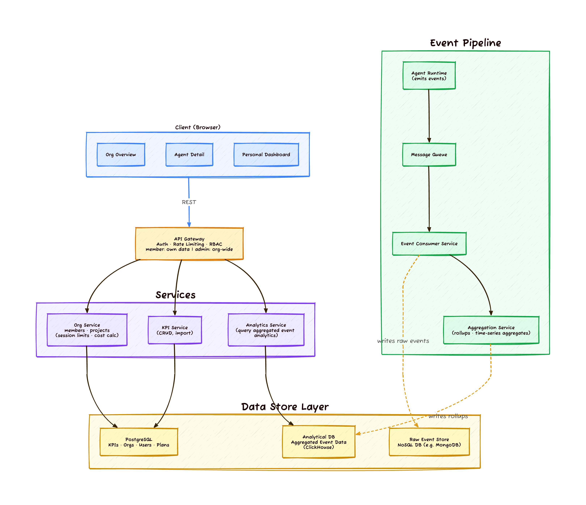
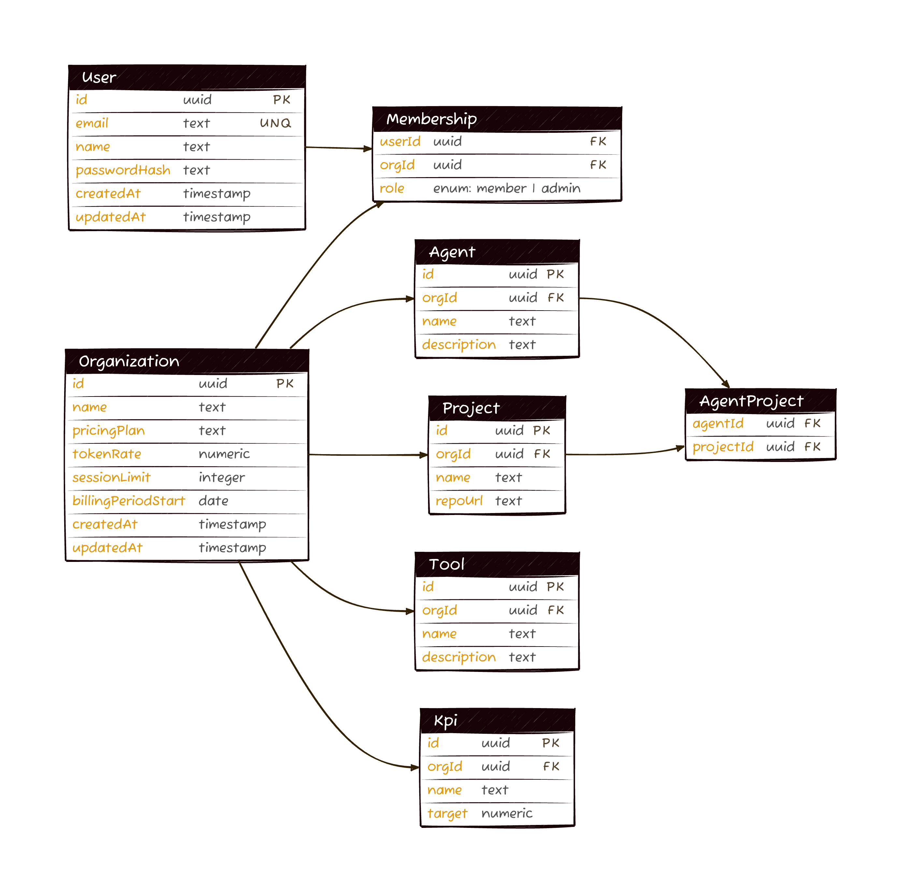

# Organizational Agents Analytics Dashboard

## Problem

Our platform allows engineers to run AI agents in the cloud. As adoption grows, organizations lack visibility into how agents are being used — there is no centralized way to track agent executions, gather usage statistics, evaluate token and seat-based costs, or map agent activity back to company projects and KPIs. Without this, engineering leads and admins cannot justify spend, identify underutilized tooling, or correlate agent usage with business outcomes.

## Proposed Solution

A customer-facing analytics dashboard embedded in the platform's web UI, providing real-time and historical views of agent usage across the organization.

#### High-Level Architecture



**Key architectural decisions:**

1. **Asynchronous event ingestion via message queue** — Agent runtime emits events into a message queue (Kafka, SQS, or RabbitMQ) rather than writing directly to a database. This decouples event producers from consumers, absorbs traffic spikes, and ensures no events are lost if downstream services are temporarily unavailable.

2. **Dedicated Event Consumer Service** — A consumer service sits between the message queue and both the raw event store and the aggregation service. It is responsible for:
    - **Validation** — schema checks, deduplication by event ID, rejecting malformed payloads.
    - **Enrichment** — resolving `orgId`/`userId` context, attaching pricing metadata, normalizing invocation channel labels.
    - **Fan-out** — writing validated raw events to the NoSQL store (Mongo) for retention and forwarding enriched events to the Aggregation Service for rollup processing.
    - This separation keeps the aggregation logic free from ingestion concerns and allows each layer to scale independently.

3. **Raw events persisted in a NoSQL store** — Raw agent run events are written to a document database (e.g., MongoDB) optimized for high write throughput and flexible schema evolution. This store serves as the system of record for event data within the retention window.

4. **Separate analytical database for aggregated data** — Pre-computed rollups (hourly, daily) are stored in a columnar analytical database (e.g., ClickHouse) tuned for fast time-series reads. This keeps dashboard query latency low regardless of raw event volume.

5. **Three-database separation** — Raw events (NoSQL), aggregated analytics (ClickHouse), and domain entities (PostgreSQL for orgs, users, KPIs, plans) each live in purpose-fit stores. This avoids contention between write-heavy ingestion, read-heavy analytics queries, and transactional CRUD operations.

6. **Aggregation Service as an independent process** — Runs as a standalone service (or scheduled cron) that reads enriched events and maintains rollup tables. It can be restarted, scaled, or re-run for backfills without affecting real-time ingestion or the API layer.

7. **RBAC enforced at the API Gateway** — All authorization logic (member sees own data, admin sees org-wide) is applied at the gateway before requests reach downstream services, ensuring a single enforcement point.

#### Authentication using an Auth Provider

Authentication is delegated to a managed provider. Our DB retains `organizations` and `memberships` tables for domain-specific fields (pricing, session limits, KPI permissions), referencing external user IDs.
Auth security is the provider's responsibility. Enterprise SSO (SAML/OIDC) is a config toggle. Pre-built UI components (login, org switcher, invites) accelerate shipping.

#### Invocation Channel Detection

Since we control the agent runtime, each entry point tags the run:

| Channel            | How Detected                                            |
|--------------------|---------------------------------------------------------|
| CLI                | Agent SDK sets `channel = "cli"` from CLI entrypoint    |
| Web UI (generic)   | Frontend sets `channel = "web"` in API call             |
| Custom Web UI      | Frontend sets `channel = "web:custom:{app_name}"`       |
| Slack integration  | Bot handler sets `channel = "integration:slack"`        |
| Linear integration | Webhook handler sets `channel = "integration:linear"`   |
| API direct         | API gateway sets `channel = "api"` if no channel header |

## User Stories

**Story 1: Admin reviews monthly agent spend**
- **As an** org admin
- **I want to** see total token usage and approximate cost across all agents for the current billing period, broken down by team and agent
- **So that** I can report to finance and justify our agent platform spend

**Story 2: Engineer checks personal usage against session limit**
- **As a** team member on a seat-based plan
- **I want to** see how many sessions I've used this period and how close I am to my limit
- **So that** I can pace my usage or request a limit increase before hitting the cap

**Story 3: Admin investigates adoption by channel**
- **As an** org admin
- **I want to** see which invocation channels (CLI, Slack, Web UI) drive the most agent usage
- **So that** I can focus developer enablement efforts on underutilized channels and understand adoption patterns

**Story 4: Admin correlates agent usage with KPIs**
- **As an** org admin who has linked a "deployment frequency" KPI to the CI/CD agent
- **I want to** see the KPI trend overlaid on agent usage over the past quarter
- **So that** I can assess whether increased agent usage correlates with improved deployment frequency

## Out of scope

- **Causal KPI attribution** — we show correlation, not "this agent caused this KPI change"
- **Agent configuration/management** — this is analytics only, not a control plane
- **Per-run detailed logs/traces** — we show metadata, not full conversation logs (that's a separate observability concern)
- **Billing/invoicing** — we show approximate costs for visibility; actual billing is handled by the billing system
- **Custom report builder** — fixed views; custom queries/exports could be a future enhancement

## Dashboard Views

**1. Organization Overview (Admin)**
- Total runs, total tokens, total cost (time-period selectable)
- Usage trend chart (daily/weekly/monthly)
- Top agents by usage
- Top users by usage
- Channel breakdown (CLI / Web / Integration pie chart)
- KPI impact summary (if KPIs configured)

**2. Agent Detail View (Admin)**
- Expandable usage rows showing:
    - Run timestamp
    - User who ran it
    - Tokens used (+ approximate cost for token-based plans)
    - Session limit usage (for seat-based plans)
    - Project/repository
    - Invocation channel
    - Execution time
    - Tool calls summary (count, breakdown by tool)
- Linked KPIs with trend overlay
- Filterable by user, project, channel, date range

**3. Personal Dashboard (Member)**
- Own usage only (same metrics as agent detail, filtered to `userId = self`)
- Personal cost / session limit tracking
- "My agents" quick view

**4. Organization Settings (Admin)**

Unified settings screen with two tabs: Projects and KPIs.

**Projects tab:**
- Create/edit/delete projects (name, repository URL)

**KPIs tab:**
- Create/edit KPIs manually (name, target, measurement method)
- Import from external tools (Monday.com, Linear, Jira) via OAuth
- Link KPIs to specific agents (many-to-many via `KpiAgent`)
- KPI trend displayed alongside agent usage for correlation

## Data Models
#### Event pipeline data model

Events are stored in a NoSQL document database (e.g., MongoDB). Tool calls are embedded as a nested array within the agent run document. This keeps all data for a single run co-located, enables atomic writes, and avoids cross-document lookups.

**AgentRun document:**

```json
{
  "id": "run_abc123",
  "agentId": "agent_42",
  "userId": "user_7",
  "orgId": "org_1",
  "createdAt": "2026-03-22T10:15:00Z",
  "tokensUsed": 4820,
  "projectId": "proj_8",
  "invocationChannel": "cli",
  "sessionId": "sess_99",
  "status": "success",
  "durationMs": 12340,
  "toolCalls": [
    {
      "id": "tc_001",
      "toolName": "web_search",
      "tokensUsed": 1200,
      "durationMs": 3400,
      "status": "success",
      "createdAt": "2026-03-22T10:15:02Z"
    },
    {
      "id": "tc_002",
      "toolName": "code_exec",
      "tokensUsed": 860,
      "durationMs": 5100,
      "status": "failure",
      "createdAt": "2026-03-22T10:15:06Z"
    }
  ]
}
```

**Field reference — AgentRun (top-level):**

| Field               | Source                     | Description                                                   |
|---------------------|----------------------------|---------------------------------------------------------------|
| `id`                | Agent runtime              | Unique identifier for the run                                 |
| `agentId`           | Agent registry             | Which agent was executed                                      |
| `userId`            | Auth/session               | Who triggered it                                              |
| `orgId`             | Auth/session               | Which organization                                            |
| `createdAt`         | Agent runtime              | When the run started                                          |
| `tokensUsed`        | Agent runtime              | Input + output token count                                    |
| `projectId`         | Agent config / Git context | Repository or project association                             |
| `invocationChannel` | Entry point detection      | CLI / Web UI / Custom API / Integration (Slack, Linear, etc.) |
| `sessionId`         | Agent runtime              | Groups related runs in a session                              |
| `status`            | Agent runtime              | Success / failure / timeout                                   |
| `durationMs`        | Agent runtime              | Wall-clock execution time                                     |
| `toolCalls`         | Agent runtime              | Embedded array of tool call sub-documents                     |

**Field reference — ToolCall (embedded sub-document):**

| Field        | Source        | Description                               |
|--------------|---------------|-------------------------------------------|
| `id`         | Agent runtime | Unique identifier for the call            |
| `toolName`   | Agent runtime | Name of the tool invoked                  |
| `tokensUsed` | Agent runtime | Tokens consumed by this tool call         |
| `durationMs` | Agent runtime | Wall-clock execution time of the call     |
| `status`     | Agent runtime | Success / failure / timeout               |
| `createdAt`  | Agent runtime | When the call was made                    |

## Organization and User Data Model



- A user can belong to multiple orgs (role is per-membership, not per-user)
- Pricing config lives on the org entity
- RBAC enforced at API middleware: members see `WHERE userId = :self`, admins see `WHERE orgId = :org`
- **Project** — represents a repository or codebase; linked to agents via many-to-many `AgentProject`
- **Agent** — a registered agent within the org; linked to projects and KPIs
- **Tool** — an external capability configured per org (e.g., `web_search`, `code_exec`); unique by `(orgId, name)`
- **Kpi** — a key performance indicator tracked per org, linked to agents via `KpiAgent`

#### Pricing Calculation

There exist two possible pricing models for an organization:

**Token-based pricing:**
- `cost = tokensUsed × org.tokenRate`
- Token rate is configurable per org (set during contract/plan setup)
- Displayed as approximate cost alongside every run and in aggregate views

**Seat-based pricing:**
- Each user seat has a token limit per one session
- `usagePct = tokensUsed / sessionLimit × 100`
- Displayed as a progress bar / gauge per user
- Alerts at 80% and 100% thresholds

The pricing model is determined by `Organization.pricingPlan` — the dashboard adapts its display accordingly.

#### KPI Integration

```
┌─────────────────┐     ┌─────────────────┐
│  Monday.com     │────▶│                 │
│  Linear         │────▶│   KPI Service   │──── KPI values + trends
│  Jira           │────▶│   (OAuth sync)  │
│  Manual entry   │────▶│                 │
└─────────────────┘     └────────┬────────┘
                                 │
                                 ▼
                        ┌─────────────────┐
                        │   KpiAgent      │
                        │  (many-to-many) │
                        │                 │
                        └─────────────────┘
```

Admins link KPIs to agents. The dashboard overlays KPI trends on agent usage charts, enabling visual correlation (not causal attribution — we're explicit about this).

## Data Retention & Scale Considerations

- **Raw events**: Retained for 90 days (configurable per org/plan)
- **Hourly rollups**: Retained for 1 year
- **Daily rollups**: Retained indefinitely
- **Partitioning**: By `org_id` + time bucket for query isolation and efficient pruning
- **Estimated storage**: ~500 bytes/event × 100K events/month/org = ~50MB/month/org raw

## API Design (Key Endpoints)

```
# Aggregated usage (powers overview charts)
GET /api/orgs/:orgId/analytics/overview
  ?period=30d

# Agent detail with individual runs (expandable rows)
GET /api/orgs/:orgId/analytics/agents/:agentId
  ?period=30d&page=1&perPage=50

# Personal dashboard (implicit userId from auth)
GET /api/me/analytics
  ?period=30d

# KPI management
GET    /api/orgs/:orgId/kpis
POST   /api/orgs/:orgId/kpis
PUT    /api/orgs/:orgId/kpis/:kpiId
DELETE /api/orgs/:orgId/kpis/:kpiId
POST   /api/orgs/:orgId/kpis/:kpiId/agents
DELETE /api/orgs/:orgId/kpis/:kpiId/agents/:agentId

# KPI import triggers (post-MVP)
POST /api/orgs/:orgId/kpis/import/monday
POST /api/orgs/:orgId/kpis/import/linear
```

